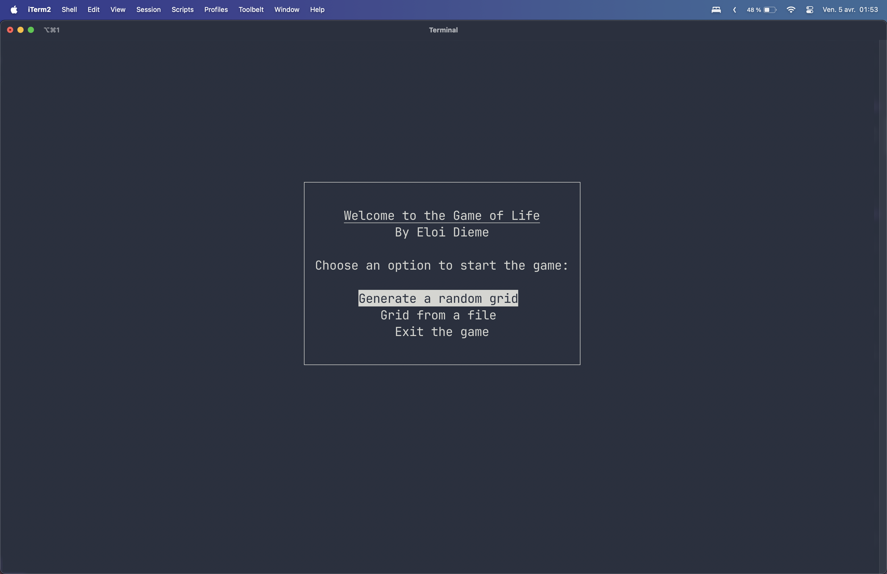
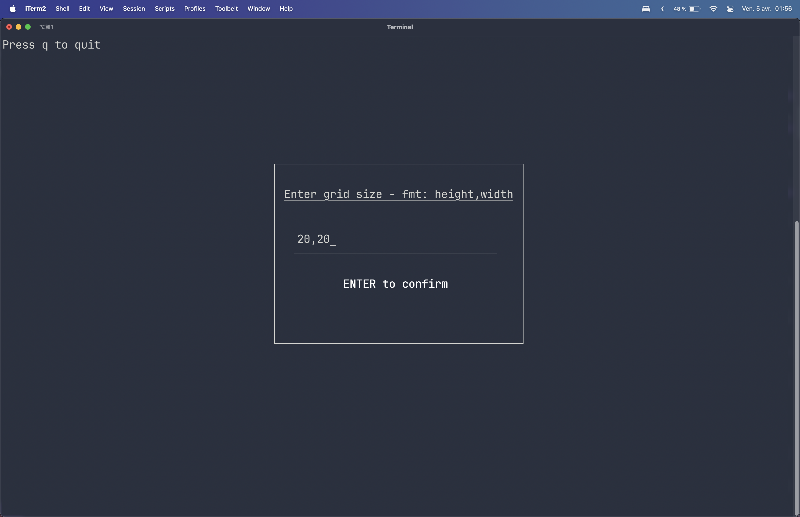
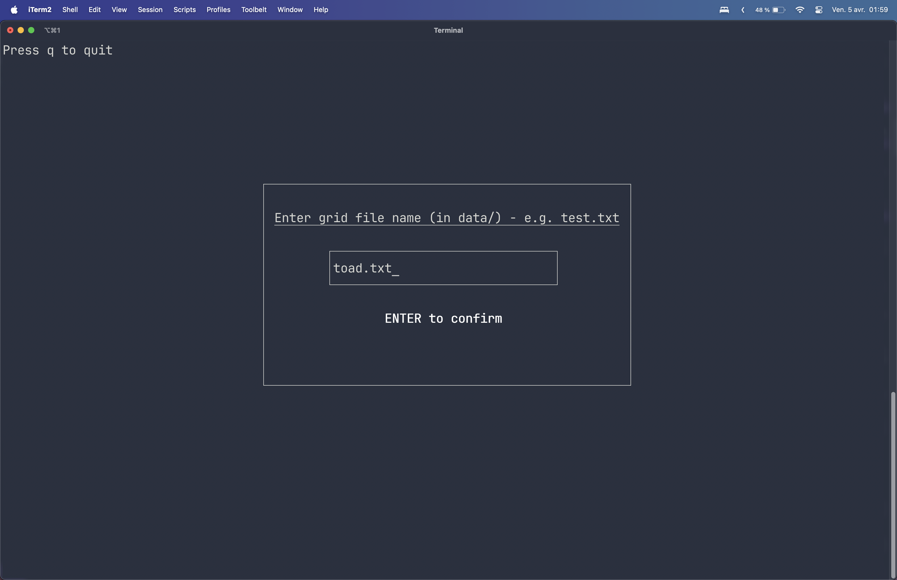

# Le Jeu de la Vie (Python)
Par **Eloi Dieme** - [Documentation (EN)](https://eloidieme.github.io/game-of-life/index.html)
<p align="center">
  
</p>

## Description
Le Jeu de la Vie est un automate cellulaire imaginé par le mathématicien britannique John Horton Conway en 1970. Ce jeu se déroule sur une grille où chaque cellule peut prendre deux états : vivante ou morte.

## Fonctionnement
Le jeu évolue à travers des générations, et l'état de chaque cellule à la prochaine génération est déterminé par son état actuel ainsi que celui de ses huit voisins immédiats selon les règles suivantes :
1. Toute cellule morte possédant exactement 3 voisins vivants devient une cellule vivante.
2. Toute cellule vivante possédant 2 ou 3 voisins vivants reste vivante, sinon elle meurt.

Dans ce programme, la grille est de taille finie. Par conséquent, une cellule au bord de la grille a des voisins sur le bord opposé, ce qui garantit à chaque cellule exactement 8 voisins.
Cette fonctionnalité de "edge wrapping" peut être désactivée lors du lancement avec l'argument -nw ou --no-wrapping.

## Démarrage rapide
### Pré-requis
* Programme testé sur Python 3.9, 3.10 et 3.11.

### Installation
Installation rapide:
```
git clone https://github.com/eloidieme/game-of-life.git
pip install -r requirements.txt
```

Installation recommandée (environnement virtuel)
* macOS/Linux
```
python -m venv venv
source venv/bin/activate

pip install -r requirements.txt
```

* Windows
```
python -m venv venv
.\venv\Scripts\activate.bat

pip install -r requirements.txt
```

### Exécution
Pour lancer l'interface terminal, exécuter depuis une fenêtre Terminal suffisamment large (et pas depuis un terminal intégré à un IDE) :
```
python main.py
```
Pour désactiver le "edge wrapping":
```
python main.py -nw
```
Puis choisir une méthode d'initialisation de grille à l'aide des flèches directionnelles.
<p align="center">
  
</p>

#### Génération aléatoire
Spécifier une taille de grille au format "hauteur, largeur".
<p align="center">
  
</p>

#### Importation
Spécifier le nom du fichier de grille présent dans le dossier "data". Les grilles disponibles d'emblée sont: 'toad.txt', 'blinker.txt', 'pulsar.txt', 'beacon.txt', 'diehard.txt', 'pentomino.txt', 'spaceship.txt' et 'glider.txt'. Le format standardisé RLE est également supporté et des grilles d'essai sont disponibles comme 'gosper_glider.rle' ou 'pentadecathlon.rle'.
<p align="center">
  
</p>


## Historique des versions
* 0.0.1: 
    * Version fonctionnelle 


