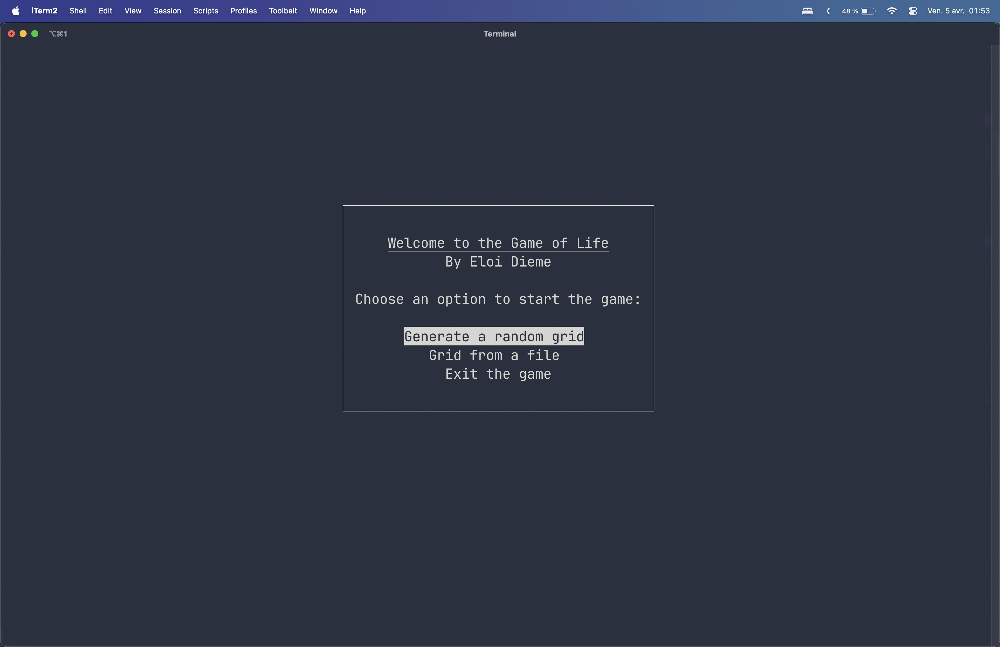
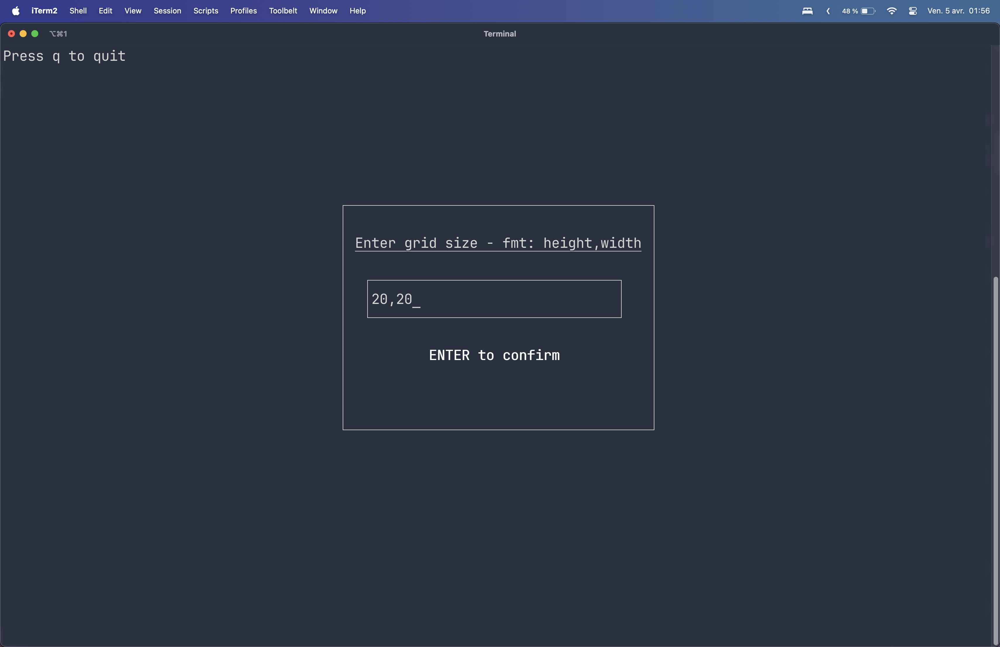

Usage
=====

Running the Program
-------------------

To launch the terminal interface, execute from a terminal window wide enough (and not from an IDE-integrated terminal):

.. code-block:: bash

   python main.py

To disable "edge wrapping":

.. code-block:: bash

   python main.py -nw

Then, choose a grid initialization method using the arrow keys.

Random Generation
-----------------

Specify a grid size in the format "height,width".

